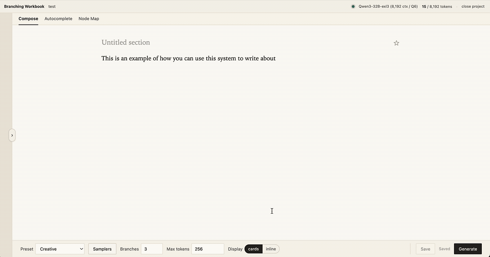

# Branching Workbook
A local LLM frontend that treats multi-completion (`n > 1`) as a first-class operation.

Branching Workbook is a local LLM frontend that generates multiple alternative continuations from one prompt. You can fan out N branches from any point, watch them stream side-by-side, and pick the one you want. The frontend is designed to run locally against a tabbyui (EXL3) backend.



## Motivation
The capability to generate N completions from one prompt has been in the inference layer for years (OpenAI's `n` parameter, supported by ExLlamaV3 via TabbyAPI). And on a single GPU, generating N completions is barely more expensive than generating one because decode is memory-bandwidth-bound, at small batch sizes so the per-token cost stays roughly flat as N grows.

Most local LLM frontends — [text-generation-webui][textgen], [KoboldCpp][kobold], [Ollama][ollama] — don't surface this. *Generate* gives you one completion; if you want alternatives, you reroll and the first one is gone.

## Interface

The system is designed to loosely mirror text-generation-webui. When you open the app, you create one of two project types.

- **Prose workbook**: a free-form text editor (i.e. textgen's notebook mode). You write a draft and branch the model's continuations into it.
- **Chat workbook (WIP)**: a chat-style conversation with system / user / assistant turns. Any assistant turn can branch into N alternative responses. I usually like to interface with models in instruct mode, so the UI for this is still somewhat clumsy and untested.

The app is built around a tree of **nodes**, a model borrowed from [Loom][loom]. Each node is a contiguous chunk of text — something you typed, something the model generated for one branch, or something you stitched together from multiple branches. Your draft at any moment is just a chain of nodes from the root of the tree down to whichever leaf you're currently sitting on.

Why structure it this way? Because the whole point is that you can save more than one alternative and come back to it. When you generate N branches, you pick which ones to keep as sibling nodes under the parent you generated from — typically one, but you can save multiple if you want to revisit alternatives later; branches you don't keep are discarded. When you edit a passage so it diverges from the current path, the new text becomes a new node and the prior version is preserved as a sibling rather than overwritten. Over time the project accumulates a tree of every direction you've chosen to keep, and any point in that tree is a place you can return to.

You'll encounter nodes in two places in the UI: a **sidebar** list of nodes shows the spine of your current draft for jumping around inside it, and the **node map** workspace (below) shows the whole tree at once.

A prose workbook has three workspace modes you can switch between (chat workbooks always use the compose):

- **Compose**: the main writing view. You write or paste into a prose editor; when you generate, N branches stream their completions alongside the editor. Pick one and it merges into the draft; the others tuck away as hidden alternatives. Branches can render as a grid of cards, a compact strip below the editor, or inline next to your caret.
- **Autocomplete** (WIP):  the same multi-completion primitive, applied to short suggestions. The model proposes a few alternative next-N-token completions as you write, shown inline. Tab accepts the visible one; `Ctrl+]` / `Ctrl+[` cycle through alternatives; Esc dismisses.
- **Node map**: a graph view of the whole tree. Pan, zoom, jump to any node to make it the active draft, star key points, hide noisy branches, merge adjacent nodes, delete subtrees.


## File format

A Branching Workbook project is a single `.bwbk` file, consisting of a SQLite database holding the whole tree of branches, the active path, project metadata, and a few UI settings. Move it, back it up, email it to yourself; it's just one file. You choose where it lives on disk, and Branching Workbook doesn't keep a recents list or sync the location anywhere. If you save the file inside an encrypted volume, the app never sees a path outside it.

Cross-project preferences (sampler presets, UI settings) live separately in a user-global SQLite under the platform's app-data directory:

- macOS: `~/Library/Application Support/bwbk/userdata.sqlite`
- Linux: `~/.local/share/bwbk/userdata.sqlite`
- Windows: `%LOCALAPPDATA%\bwbk\userdata.sqlite`

Project files never write into this store.

## Quick start

Requires [`just`][just], [`uv`][uv], and Node 20+.

```bash
just install
just dev
```

Open <http://localhost:5173>.

The default backend is a built-in mock that streams fake completions, so you can explore the UI without a GPU. To connect to a real model, see [`deploy/`](./deploy).

## Using with a real model

You bring your own TabbyAPI — running on the same machine as Branching Workbook if you have a GPU there, or on a separate host reached over an SSH tunnel (a workstation, a disposable cloud GPU — there's a [RunPod recipe](./deploy/runpod) in this repo as one example). [`deploy/README.md`](./deploy/README.md) walks through both, with env vars and a macOS-specific port note.

## Architecture

- **Client** — React + TypeScript (Vite) at `localhost:5173`.
- **Local wrapper** — FastAPI server at `localhost:8000`. Persists projects to SQLite (one `.bwbk` file per project, path of your choosing) and proxies inference calls.
- **Inference** — stock [TabbyAPI][tabby] on a GPU host you control, reached over an SSH tunnel. No SaaS in the loop, no traffic over the public internet.
- **Streaming** — server-sent events. The client routes interleaved SSE chunks to per-branch panels by `choices[i].index`.
## Repo layout

```text
client/         React + TypeScript frontend (Vite)
server/         FastAPI wrapper, SQLite persistence, TabbyAPI proxy, mock backend
deploy/         Connection guide + GPU deployment recipes (RunPod example)
justfile        just install / just dev / just check / just test
```

## Status
Developed and tested only on macOS. Should still work on windows/linux, but hasn't been tested.

## License

[MIT](./LICENSE)

[textgen]: https://github.com/oobabooga/text-generation-webui
[kobold]: https://github.com/LostRuins/koboldcpp
[ollama]: https://github.com/ollama/ollama
[tabby]: https://github.com/theroyallab/tabbyAPI
[loom]: https://github.com/socketteer/loom
[just]: https://github.com/casey/just
[uv]: https://docs.astral.sh/uv/
